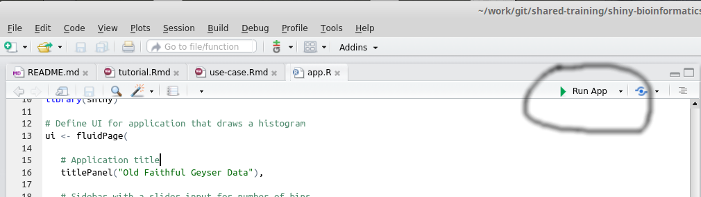

```{r setup, include=FALSE}
knitr::opts_chunk$set(echo = TRUE)
devtools::install_github("hadley/emo")
```


# An Introduction to Shiny

## R packages

You will need the following R packages to run this tutorial
```{r eval=FALSE}
install.packages("shiny")
source("http://www.bioconductor.org/biocLite.R")
biocLite("breastCancerNKI")

```

## References

- Shout-out to Monash Bioinformatics Platform for making their [course notes available](https://monashbioinformaticsplatform.github.io/2016-11-03-r-shiny/) `r emo::ji("+1")`
- Rstudio have a good collection of [tutorial videos](http://shiny.rstudio.com/tutorial/)
- The [Shiny showcase](https://www.rstudio.com/products/shiny/shiny-user-showcase/)
- A [Shiny cheatsheet](http://shiny.rstudio.com/articles/cheatsheet.html) to print off and pin to your desk
- Shiny Exercises [Part 1](http://r-exercises.com/2016/12/12/building-shiny-app-exercises-part-1/) and [Part 2](http://r-exercises.com/2016/12/18/building-shiny-app-exercises-part-2/)
- Videos from the [Shiny developers conference](https://www.rstudio.com/resources/webinars/shiny-developer-conference/)

## What is Shiny

- A way to run R code interactively
- A great way of letting others access your data without requiring Bioinformatics skills
- A way of building web portals without requiring javascript or other technologies
- But not a substitute for an interface such as RStudio

## How have we used Shiny in the C.I.

- [Demonstrating statistical concepts](http://bioinformatics.cruk.cam.ac.uk/stats/TwoSampleTest/)
- [A data portal for breast cancer models](http://caldaslab.cruk.cam.ac.uk/bcape/)
- [and a portal for Prostate Cancer](http://bioinformatics.cruk.cam.ac.uk/apps/camcAPP/)
- [Demo at the Science Festival](http://bioinformatics.cruk.cam.ac.uk/apps/apps/mutation-demo/)

# First look at a Shiny app

Create a new app by the following menu options in RStudio. When prompted for a name of the app, call it `test` or something.

**File** -> **New File** -> **Shiny web app**

A file called `app.R` should appear in RStudio, and RStudio will have created a new directory with the app name that you specified (e.g. `test`). The `app.R` script defines the UI (user interface), code to be run by the server and ends with an instruction to run the app. Note that you might see some older Shiny apps that were defined in two separate files (`UI.R` and `server.R`). If you view this file in RStudio the option to run the app will appear in the top toolbar. 



Hitting the **Run App** Button will create a new RStudio window this example app. Congratulations, you have just created your first shiny app `r emo::ji("tada")`

You could also view in a web browser. ***Please note that when presented "live" the Shiny app will appear below. On the static HTML pages linked from the course website, there will be grey box below. ***

```{r echo=FALSE}

library(shiny)

# Define UI for application that draws a histogram
ui <- fluidPage(
   
   # Application title
   titlePanel("Old Faithful Geyser Data"),
   
   # Sidebar with a slider input for number of bins 
   sidebarLayout(
      sidebarPanel(
         sliderInput("bins",
                     "Number of bins:",
                     min = 1,
                     max = 50,
                     value = 30)
      ),
      
      # Show a plot of the generated distribution
      mainPanel(
         plotOutput("distPlot")
      )
   )
)

# Define server logic required to draw a histogram
server <- function(input, output) {
   
   output$distPlot <- renderPlot({
      # generate bins based on input$bins from ui.R
      x    <- faithful[, 2] 
      bins <- seq(min(x), max(x), length.out = input$bins + 1)
      
      # draw the histogram with the specified number of bins
      hist(x, breaks = bins, col = 'darkgray', border = 'white')
   })
}

# Run the application 
shinyApp(ui = ui, server = server)


```


In this example app we are creating a histogram of a pre-defined dataset (`faithful`), with the user being able to specify how many bins to use in the histogram. Let's first look at the part of the script that defines the interface.


```{r eval=FALSE}
ui <- fluidPage(
   
   # Application title
   titlePanel("Old Faithful Geyser Data"),
   
   # Sidebar with a slider input for number of bins 
   sidebarLayout(
      sidebarPanel(
         sliderInput("bins",
                     "Number of bins:",
                     min = 1,
                     max = 50,
                     value = 30)
      ),
      
      # Show a plot of the generated distribution
      mainPanel(
         plotOutput("distPlot")
      )
   )
)
```

- The layout of the app is using the sidebar style. 
- There are two panels in the app layout; defined by the `sidebarPanel` and `mainPanel` arguments respectively
- A slider bar is used to choose a different value of `bins`, and this value can be accessed as `input$bins` from within in the `server` function (see later).  
- A plot is displayed in the main panel

## HTML and other formatting

HTML elements can be added by a number of functions that parallel common HTML tags. e.g. `h1`, `h2` for headers and `a` to create a hyperlink. The `helpText` function can also be used to add explanatory text below a particular input option. In the following code we add headers, some help text and a hyperlink to a reference about histograms. Images can also be added using the `img` function.

You can try copy-and-pasting this code over the default `sidebarPanel` function call in the `app.R` file you have created.

```{r eval=FALSE}
      ######
      sidebarPanel(

        h1("Data  Exploration Options"),
        h2("The histogram"),
         sliderInput("bins",
                     "Number of bins:",
                     min = 1,
                     max = 50,
                     value = 30),
        helpText("This slider defines the number of bins to divide the data into"),
        a("More about the histogram here", href="https://en.wikipedia.org/wiki/Histogram"),
        br(),
        p("App developed by University of Cambridge"),
        img(src="http://www.cruk.cam.ac.uk/sites/all/themes/cambridge_theme/images/interface/main-logo-small.png")
      ),
      ######
```


```{r echo=FALSE}
library(shiny)

# Define UI for application that draws a histogram
ui <- fluidPage(
   
   # Application title
   titlePanel("Old Faithful Geyser Data"),
   
   # Sidebar with a slider input for number of bins 
   sidebarLayout(
      sidebarPanel(
        h1("Data  Exploration Options"),
        h2("The histogram"),
         sliderInput("bins",
                     "Number of bins:",
                     min = 1,
                     max = 50,
                     value = 30),
        helpText("This slider defines the number of bins to divide the data into"),
        a("More about the histogram here", href="https://en.wikipedia.org/wiki/Histogram"),
        br(),
        p("App developed by University of Cambridge"),
        img(src="http://www.cruk.cam.ac.uk/sites/all/themes/cambridge_theme/images/interface/main-logo-small.png")
      ),
      
      # Show a plot of the generated distribution
      mainPanel(
         plotOutput("distPlot")
      )
   )
)

# Define server logic required to draw a histogram
server <- function(input, output) {
   
   output$distPlot <- renderPlot({
      # generate bins based on input$bins from ui.R
      x    <- faithful[, 2] 
      bins <- seq(min(x), max(x), length.out = input$bins + 1)
      
      # draw the histogram with the specified number of bins
      hist(x, breaks = bins, col = 'darkgray', border = 'white')
   })
}

# Run the application 
shinyApp(ui = ui, server = server)

```


## Inputs

This histogram example uses the `sliderInput` function which allows the user to select a numeric value for the number of *bins* to allocate the data to between some lower and upper bound. We also have control over the amount by which the values change when the user slides the bar with `step`, and the text label displayed above the bar. (See `?sliderInput` for details).

Other types of input are available for us to choose from and follow a similar syntax. i.e. each type of input has a `value` and `label` argument

- `selectInput`
    + select a value from a drop-down box
- `checkboxInput`
    + set a value to true or false
- `radioButons`
    + select a value 
- `textInput`
    + type some text
- `dateInput`
    + select a date
- `fileInput`
    + special input to upload a file

To add an extra input option, we need to add it as an argument to the `sidebarPanel` function. We could add a option to colour the histogram using the `radioButton` function. The order of the arguments to `sidebarPanel` dictates the order in which the various elements are rendered in the HTML.


```{r eval=FALSE}
      ######
      sidebarPanel(

        h1("Data  Exploration"),
        h2("The histogram"),
        radioButtons("colour","Colour of histogram",choices=c("red","green","blue"),selected="red"),
         sliderInput("bins",
                     "Number of bins:",
                     min = 1,
                     max = 50,
                     value = 30),
        helpText("This slider defines the number of bins to divided the data into"),
        a("More about the histogram here", href="https://en.wikipedia.org/wiki/Histogram"),
        br(),
        p("App developed by University of Cambridge"),
        img(src="http://www.cruk.cam.ac.uk/sites/all/themes/cambridge_theme/images/interface/main-logo-small.png")
      ),
      ######
```

To actually access the value that has been selected, we need to modify the code in the `server` section of our `app.R` script. On the line that creates the histogram we merely change the `col` argument from the original `darkgray` to `input$colour`.


```{r eval=FALSE}
server <- function(input, output) {
   
   output$distPlot <- renderPlot({
      # generate bins based on input$bins from ui.R
      x    <- faithful[, 2] 
      bins <- seq(min(x), max(x), length.out = input$bins + 1)
      
      # draw the histogram with the specified number of bins
      #Now change the colour of the histogram too
      hist(x, breaks = bins, col = input$colour, border = 'white')
   })
}

```


```{r echo=FALSE}
library(shiny)

# Define UI for application that draws a histogram
ui <- fluidPage(
   
   # Application title
   titlePanel("Old Faithful Geyser Data"),
   
   # Sidebar with a slider input for number of bins 
   sidebarLayout(
      sidebarPanel(
        h1("Data  Exploration"),
        h2("The histogram"),
        radioButtons("colour","Colour of histogram",choices=c("red","green","blue"),selected="red"),
         sliderInput("bins",
                     "Number of bins:",
                     min = 1,
                     max = 50,
                     value = 30),
        helpText("This slider defines the number of bins to divided the data into"),
        a("More about the histogram here", href="https://en.wikipedia.org/wiki/Histogram"),
        br(),
        p("App developed by University of Cambridge"),
        img(src="http://www.cruk.cam.ac.uk/sites/all/themes/cambridge_theme/images/interface/main-logo-small.png")
      ),
      
      # Show a plot of the generated distribution
      mainPanel(
         plotOutput("distPlot")
      )
   )
)

# Define server logic required to draw a histogram
server <- function(input, output) {
   
   output$distPlot <- renderPlot({
      # generate bins based on input$bins from ui.R
      x    <- faithful[, 2] 
      bins <- seq(min(x), max(x), length.out = input$bins + 1)
      
      # draw the histogram with the specified number of bins

      
      hist(x, breaks = bins, col = input$colour, border = 'white')
   })
   
}

# Run the application 
shinyApp(ui = ui, server = server)

```


Note, that the capatilisation of the colours is important in the definition of the `radioInput`, as `red`, `green` and `blue` are all valid colours in R, whereas `Red` is not. If you wanted the names of the colours to be displayed nicer in the UI, you can change the `Choices` vector.

```{r eval=FALSE}
        radioButtons("colour","Colour of histogram",choices=c("Red","Green","Blue"),selected="Red"),

```

However, as these are not valid names of colours in R, we need to do some extra processing before we can call the `hist` function. We can access the value of `input$colour` and modify accordingly. For example, we could use the `tolower` function to convert to lower case. 

```{r eval=FALSE}
   output$distPlot <- renderPlot({
      # generate bins based on input$bins from ui.R
      x    <- faithful[, 2] 
      bins <- seq(min(x), max(x), length.out = input$bins + 1)
      
      # draw the histogram with the specified number of bins
      mycolour <- tolower(input$colour)
      
      hist(x, breaks = bins, col = mycolour, border = 'white')
   })
```

## Exercises

- Allow the user to define the title on the plot by adding a `textInput`
    + HINT: the `main` argument to the `hist` function lets you set the plot title.
- The choice of red, green or blue is somewhat limiting. Create a dropdown box (`selectInput`) to allow the user to choose from any of the pre-defined colours in R. (HINT: the function `colours` returns the names of all valid colours as a vector)
- OPTIONAL:- use `numericInput` boxes to allow the user to define a colour using its red, green and blue values.
    + the `rgb` function will convert a set of numeric values into a hexademical string that can be used as an argument for plotting.
    + the RGB value for red is `255,0,0`


```{r echo=FALSE}
library(shiny)

# Define UI for application that draws a histogram
ui <- fluidPage(
   
   # Application title
   titlePanel("Old Faithful Geyser Data"),
   
   # Sidebar with a slider input for number of bins 
   sidebarLayout(
      sidebarPanel(
        h1("Data  Exploration"),
        h2("The histogram"),
        selectInput(inputId = "colour","Colour of histogram",choices=colours(),selected="red"),
         sliderInput("bins",
                     "Number of bins:",
                     min = 1,
                     max = 50,
                     value = 30),
        helpText("This slider defines the number of bins to divided the data into"),
        textInput(inputId = "title",label="Histogram Title",value = "Histogram of x")
      ),
      
      # Show a plot of the generated distribution
      mainPanel(
         plotOutput("distPlot")
      )
   )
)

# Define server logic required to draw a histogram
server <- function(input, output) {
   
   output$distPlot <- renderPlot({
      # generate bins based on input$bins from ui.R
      x    <- faithful[, 2] 
      bins <- seq(min(x), max(x), length.out = input$bins + 1)
      
      # draw the histogram with the specified number of bins

      
      hist(x, breaks = bins, col = input$colour, border = 'white',main=input$title)
   })
   
}

# Run the application 
shinyApp(ui = ui, server = server)

```


## Outputs

We can add new outputs by adding new arguments to `mainPanel`. Let's say we want to show a boxplot of the data in addition to the histogram. First we add a call to `plotOutput` in the `mainPanel` code with our choice of object name. Let's call it `boxPlot`
 


```{r eval=FALSE}

      # Show a plot of the generated distribution
      mainPanel(
         plotOutput("distPlot"),
         plotOutput("boxPlot")
      )
   )
)

```

We now need to modify the server code to create an object `ouput$boxPlot` using the `renderPlot` function. Inside the body of `renderPlot` we write the code to create the boxplot.

However, the following code is incorrect. Can you work out why? `r emo::ji("question")`

```{r eval=FALSE}
server <- function(input, output) {
   
   output$distPlot <- renderPlot({
      # generate bins based on input$bins from ui.R
      x    <- faithful[, 2] 
      bins <- seq(min(x), max(x), length.out = input$bins + 1)
      
      # draw the histogram with the specified number of bins

      
      hist(x, breaks = bins, col = input$colour, border = 'white',main=input$title)
   })
   
   output$boxPlot <- renderPlot({

       boxplot(x,horizontal=TRUE,col=input$colour)

   })
}
```

```{r echo=FALSE}
library(shiny)

# Define UI for application that draws a histogram
ui <- fluidPage(
   
   # Application title
   titlePanel("Old Faithful Geyser Data"),
   
   # Sidebar with a slider input for number of bins 
   sidebarLayout(
      sidebarPanel(
        h1("Data  Exploration"),
        h2("The histogram"),
        radioButtons("colour","Colour of histogram",choices=c("red","green","blue"),selected="red"),
         sliderInput("bins",
                     "Number of bins:",
                     min = 1,
                     max = 50,
                     value = 30),
        helpText("This slider defines the number of bins to divided the data into"),
        a("More about the histogram here", href="https://en.wikipedia.org/wiki/Histogram"),
        br(),
        p("App developed by University of Cambridge"),
        img(src="http://www.cruk.cam.ac.uk/sites/all/themes/cambridge_theme/images/interface/main-logo-small.png")
      ),
      
      # Show a plot of the generated distribution
      mainPanel(
         plotOutput("distPlot"),
         plotOutput("boxPlot")
      )
   )
)

# Define server logic required to draw a histogram
server <- function(input, output) {
   
   output$distPlot <- renderPlot({
      # generate bins based on input$bins from ui.R
      x    <- faithful[, 2] 
      bins <- seq(min(x), max(x), length.out = input$bins + 1)
      
      # draw the histogram with the specified number of bins

      
      hist(x, breaks = bins, col = input$colour, border = 'white',main=input$title)
   })

   
   output$boxPlot <- renderPlot({
      boxplot(x,horizontal = TRUE,col=input$colour)
     
   })
}

# Run the application 
shinyApp(ui = ui, server = server)

```


Aside from a plot, other types of output include

- `renderText`
- `renderPrint`
- `renderDataTable`
- `renderTable`


We will add a numerical summary of our dataset and a message to report the number of bins that were selected. These elements can be added to the `mainPanel` using `verbatimTextOutput` and `textOutput` respectively:-

```{r eval=FALSE}

      # Show a plot of the generated distribution
      mainPanel(
         textOutput("chosenBins"),
         plotOutput("distPlot"),
         verbatimTextOutput("summary"),
         plotOutput("boxPlot")
      )


```

In the `server` function we include the code to compute the relevant outputs. Note that in the first line of the function we define our vector `x` so that it is visible to all output functions. It probably wouldn't be an issue with this small example, but for larger datasets we really only want to create the dataset once and be able to access it from all output functions. However, this means that the dataset cannot be modified once the app has started. If we wanted data that can be updated, we would have to use another approach that we will describe in the next section.

```{r eval=FALSE}
server <- function(input, output) {
     x    <- faithful[, 2] 
         
   output$distPlot <- renderPlot({
      # generate bins based on input$bins from ui.R
      bins <- seq(min(x), max(x), length.out = input$bins + 1)
      
      # draw the histogram with the specified number of bins

      
      hist(x, breaks = bins, col = input$colour, border = 'white')
   })
   
   output$boxPlot <- renderPlot({

       boxplot(x,col=input$colour)

   })
   
   output$summary <- renderPrint({
     summary(x)
   })
   
   output$chosenBins <- renderText({
     
     paste("Number of bins to draw histogram", input$bins)
     
   })
}
```


```{r echo=FALSE}

library(shiny)

# Define UI for application that draws a histogram
ui <- fluidPage(
   
   # Application title
   titlePanel("Old Faithful Geyser Data"),
   
   # Sidebar with a slider input for number of bins 
   sidebarLayout(
      sidebarPanel(
        h1("Data  Exploration"),
        h2("The histogram"),
        radioButtons("colour","Colour of histogram",choices=c("red","green","blue"),selected="red"),
         sliderInput("bins",
                     "Number of bins:",
                     min = 1,
                     max = 50,
                     value = 30),
        helpText("This slider defines the number of bins to divided the data into"),
        a("More about the histogram here", href="https://en.wikipedia.org/wiki/Histogram"),
        br(),
        p("App developed by University of Cambridge"),
        img(src="http://www.cruk.cam.ac.uk/sites/all/themes/cambridge_theme/images/interface/main-logo-small.png")
      ),
      
      # Show a plot of the generated distribution
      mainPanel(
         textOutput("chosenBins"),
         plotOutput("distPlot"),
         verbatimTextOutput("summary"),
         plotOutput("boxPlot")
      )
   )
)

server <- function(input, output) {
     x    <- faithful[, 2] 
         
   output$distPlot <- renderPlot({
      # generate bins based on input$bins from ui.R
      bins <- seq(min(x), max(x), length.out = input$bins + 1)
      
      # draw the histogram with the specified number of bins

      
      hist(x, breaks = bins, col = input$colour, border = 'white')
   })
   
   output$boxPlot <- renderPlot({

       boxplot(x,col=input$colour)

   })
   
   output$summary <- renderPrint({
     summary(x)
   })
   
   output$chosenBins <- renderText({
     
     paste("Number of bins to draw histogram", input$bins)
     
   })
}

# Run the application 
shinyApp(ui = ui, server = server)
```


The results panel is now getting a bit cluttered. If we wish we could change the layout so each distinct output is displayed in a different panel. This can be done with the `tabsetPanel` function.

```{r eval=FALSE}
      mainPanel(
        tabsetPanel(
          tabPanel("Bins", textOutput("chosenBins")),
          tabPanel("Histogram",plotOutput("distPlot")),
          tabPanel("Summary", verbatimTextOutput("summary")),
          tabPanel("Boxplot", plotOutput("boxPlot"))
          
        )

      )

```


```{r echo=FALSE}
library(shiny)

# Define UI for application that draws a histogram
ui <- fluidPage(
   
   # Application title
   titlePanel("Old Faithful Geyser Data"),
   
   # Sidebar with a slider input for number of bins 
   sidebarLayout(
      sidebarPanel(
        h1("Data  Exploration"),
        h2("The histogram"),
        radioButtons("colour","Colour of histogram",choices=c("red","green","blue"),selected="red"),
         sliderInput("bins",
                     "Number of bins:",
                     min = 1,
                     max = 50,
                     value = 30),
        helpText("This slider defines the number of bins to divided the data into"),
        a("More about the histogram here", href="https://en.wikipedia.org/wiki/Histogram"),
        br(),
        p("App developed by University of Cambridge"),
        img(src="http://www.cruk.cam.ac.uk/sites/all/themes/cambridge_theme/images/interface/main-logo-small.png")
      ),
      
      # Show a plot of the generated distribution
      mainPanel(
        tabsetPanel(
          tabPanel("Bins", textOutput("chosenBins")),
          tabPanel("Histogram",plotOutput("distPlot")),
          tabPanel("Summary", verbatimTextOutput("summary")),
          tabPanel("Boxplot", plotOutput("boxPlot"))
          
        )

      )
   )
)

# Define server logic required to draw a histogram
server <- function(input, output) {
    x    <- faithful[, 2] 
   output$distPlot <- renderPlot({
      # generate bins based on input$bins from ui.R

      bins <- seq(min(x), max(x), length.out = input$bins + 1)
      
      # draw the histogram with the specified number of bins

      
      hist(x, breaks = bins, col = input$colour, border = 'white',main=input$title)
   })
   
   output$summary <- renderPrint({
     summary(x)
   })
   
   output$boxPlot <- renderPlot({
      boxplot(x,horizontal = TRUE,col=input$colour)
     
   })
   
      output$chosenBins <- renderText({
     
     paste("Number of bins to draw histogram", input$bins)
     
   })
   
}

# Run the application 
shinyApp(ui = ui, server = server)

```

The final code for the app is given below:-

```{r eval=FALSE}
library(shiny)

# Define UI for application that draws a histogram
ui <- fluidPage(
   
   # Application title
   titlePanel("Old Faithful Geyser Data"),
   
   # Sidebar with a slider input for number of bins 
   sidebarLayout(
      sidebarPanel(
        h1("Data  Exploration"),
        h2("The histogram"),
        radioButtons("colour","Colour of histogram",choices=c("red","green","blue"),selected="red"),
         sliderInput("bins",
                     "Number of bins:",
                     min = 1,
                     max = 50,
                     value = 30),
        helpText("This slider defines the number of bins to divided the data into"),
        a("More about the histogram here", href="https://en.wikipedia.org/wiki/Histogram"),
        br(),
        p("App developed by University of Cambridge"),
        img(src="http://www.cruk.cam.ac.uk/sites/all/themes/cambridge_theme/images/interface/main-logo-small.png")
      ),
      
      # Show a plot of the generated distribution
      mainPanel(
        tabsetPanel(
          tabPanel("Bins", textOutput("chosenBins")),
          tabPanel("Histogram",plotOutput("distPlot")),
          tabPanel("Summary", verbatimTextOutput("summary")),
          tabPanel("Boxplot", plotOutput("boxPlot"))
          
        )

      )
   )
)

# Define server logic required to draw a histogram
server <- function(input, output) {
    x    <- faithful[, 2] 
   output$distPlot <- renderPlot({
      # generate bins based on input$bins from ui.R

      bins <- seq(min(x), max(x), length.out = input$bins + 1)
      
      # draw the histogram with the specified number of bins

      
      hist(x, breaks = bins, col = input$colour, border = 'white',main=input$title)
   })
   
   output$summary <- renderPrint({
     summary(x)
   })
   
   output$boxPlot <- renderPlot({
      boxplot(x,horizontal = TRUE,col=input$colour)
     
   })
   
      output$chosenBins <- renderText({
     
     paste("Number of bins to draw histogram", input$bins)
     
   })
   
}

# Run the application 
shinyApp(ui = ui, server = server)

```

